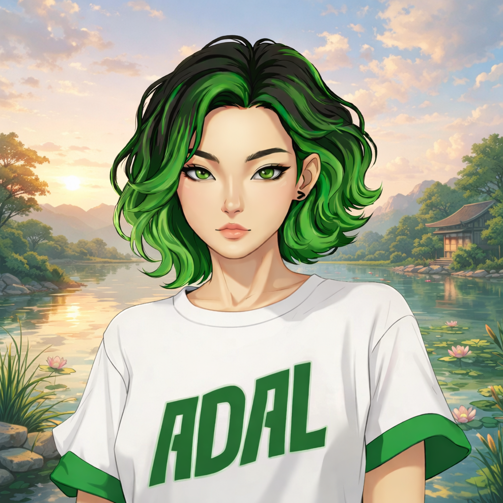

# AdaL CLI Documentation

<div align="center">
  
  <br />
  <strong>Your CLI agent for engineering and research</strong>
  <br /><br />
  
  [View Docs](https://adal-cli-docs.onrender.com) · [Report Issue](#reporting-issues) · [Contribute](#contributing)
</div>

---

## About This Repository

This is the **public documentation site** for [AdaL CLI](https://github.com/SylphAI-Inc/adal-cli), built with Docusaurus. We welcome community contributions!

**What you can do here:**
- **Report issues** with AdaL CLI agent behavior
- **Suggest documentation fixes** or improvements
- **Contribute** to make the docs better

## 🐛 Reporting Issues

Found a bug with AdaL CLI or notice something wrong in the docs?

**[Open an Issue](https://github.com/SylphAI-Inc/adal-cli/issues/new)**

Please include:
- What you expected vs what happened
- Steps to reproduce (if applicable)
- AdaL CLI version (`adal -v`)
- OS and terminal

## 📝 Contributing

We appreciate documentation improvements! Here's how:

### Quick Edits

1. Navigate to the doc you want to fix at [adal-cli-docs.onrender.com](https://adal-cli-docs.onrender.com)
2. Note the page path (e.g., `/features/slash-commands`)
3. Find the corresponding file in `docs-site/docs/`
4. Edit and submit a PR

### Running Locally

```bash
cd docs-site

# Install dependencies
npm install

# Start development server (opens http://localhost:3000)
npm run start

# Build for production
npm run build
```

### Contribution Guidelines

- Keep docs clear and concise
- Test your changes locally with `npm run build`
- Follow existing formatting conventions

## Documentation Structure

```
docs-site/
├── docs/                    # Documentation pages (markdown)
│   ├── 01-getting-started/  # Quickstart, installation
│   ├── 03-features/         # Feature documentation
│   ├── 07-troubleshooting/  # Common issues
│   └── build-with-adal/     # Advanced usage
├── static/                  # Images and assets
└── src/                     # React components, custom CSS
```

## Links

- **Docs Site:** [adal-cli-docs.onrender.com](https://adal-cli-docs.onrender.com)
- **AdaL CLI:** [github.com/SylphAI-Inc/adal-cli](https://github.com/SylphAI-Inc/adal-cli)
- **Follow AdaL:** [github.com/adal-cli](https://github.com/adal-cli)
- **Discord:** [Join our community](https://discord.com/invite/ezzszrRZvT)

---

<div align="center">
  <strong>Star <a href="https://github.com/SylphAI-Inc/adal-cli">AdaL CLI</a> · Follow <a href="https://github.com/adal-cli">AdaL</a></strong>
  <br />
  Documentation built by AdaL herself · Created by <a href="https://sylph.ai">SylphAI</a>
</div>

